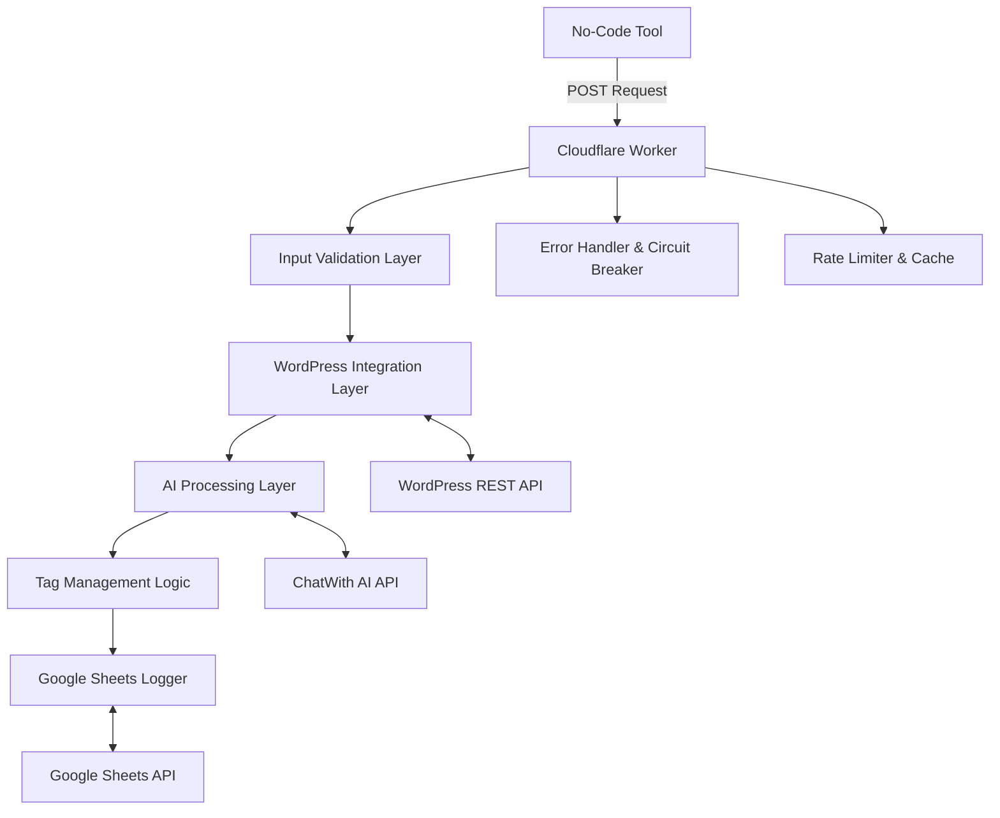
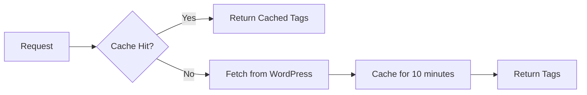
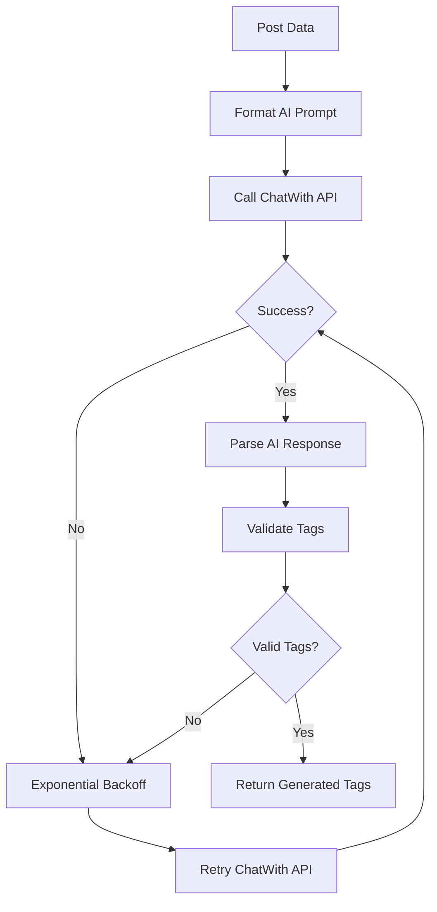
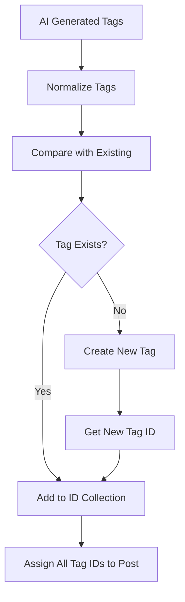
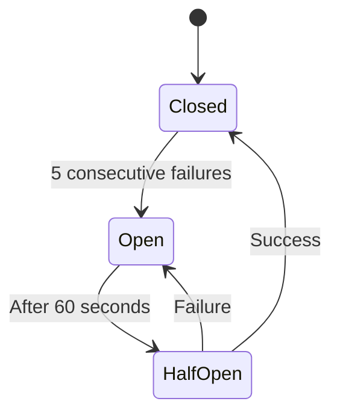
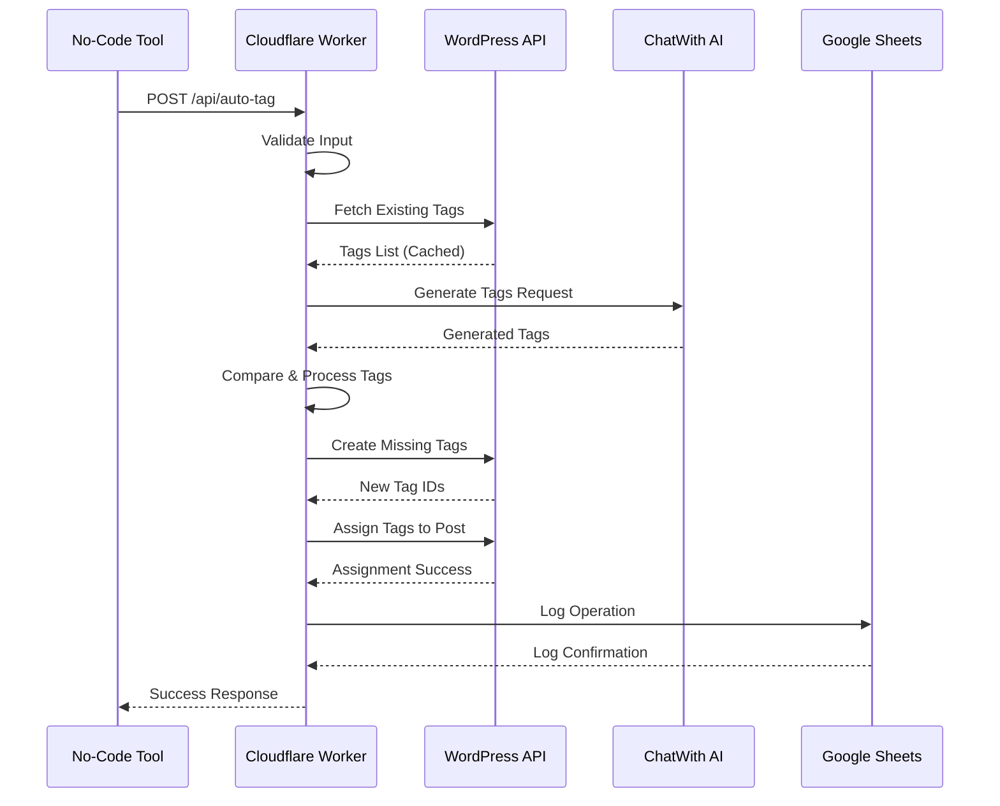
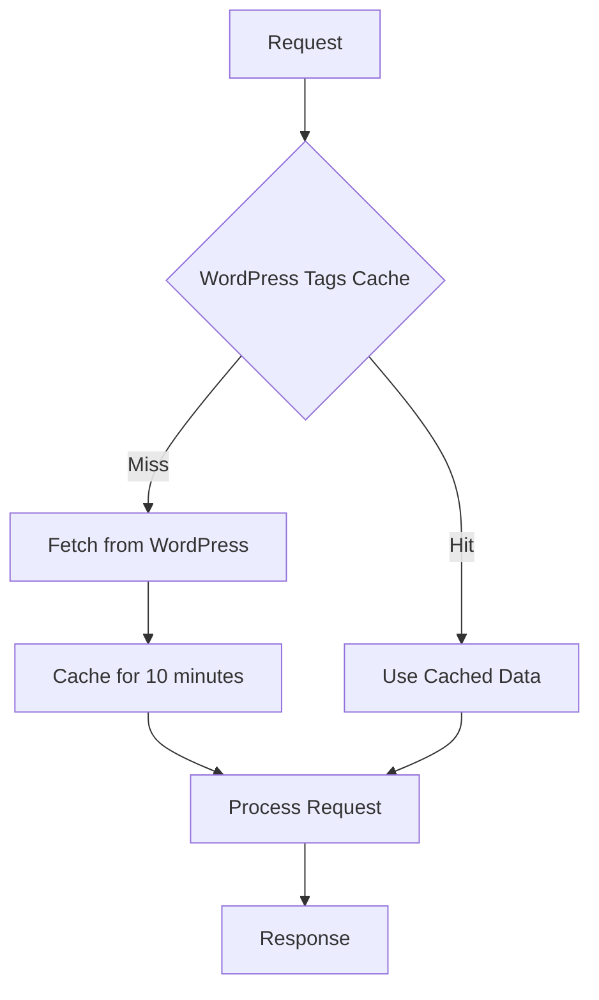

# WordPress Auto-Tagging API - Technical Architecture

## Executive Summary

This document outlines the technical architecture for a WordPress Auto-Tagging API workflow built on Cloudflare Workers. The system processes individual WordPress posts, generates AI-powered tags, and integrates with no-code automation tools while maintaining resilience for medium-volume traffic (100-1,000 posts/day).

## System Overview

### Core Requirements
- **Endpoint**: POST `https://api.processfy.ai/api/auto-tag`
- **Processing Model**: Stateless, single-post processing
- **Volume Design**: Medium volume (100-1,000 posts/day) with resilience features
- **Authentication**: WordPress Application Passwords only
- **AI Failure Handling**: Persistent retry until resolution
- **Integration Target**: No-code tools (Zapier, Pabbly, n8n)

### High-Level Architecture



## Detailed Component Architecture

### 1. Input Validation Layer

**Purpose**: Validate and sanitize incoming requests before processing

**Validation Rules**:
```javascript
{
  wp_url: "required|url|wordpress_site",
  wp_auth: "required|application_password_format",
  post_id: "required|integer|positive",
  is_live: "required|exact:yes",
  tags: "required|empty_or_null"
}
```

**Response Structure**:
```json
{
  "success": false,
  "error": {
    "code": "VALIDATION_ERROR",
    "message": "Post already has tags assigned",
    "field": "tags",
    "details": "is_live must be 'yes' and tags must be empty"
  }
}
```

### 2. WordPress Integration Layer

**Purpose**: Handle all WordPress REST API interactions with resilience

**Key Functions**:
- Fetch existing tags with pagination handling
- Create new tags via REST API
- Assign tag IDs to posts
- Handle authentication via Application Passwords

**Caching Strategy**:


**Pagination Handling**:
```javascript
// Pseudo-code for tag fetching
async function fetchAllTags(wpUrl, auth) {
  let allTags = [];
  let page = 1;
  let hasMore = true;
  
  while (hasMore) {
    const response = await fetch(`${wpUrl}/wp-json/wp/v2/tags?per_page=100&page=${page}`, {
      headers: { Authorization: `Basic ${auth}` }
    });
    
    const tags = await response.json();
    allTags = [...allTags, ...tags];
    
    hasMore = tags.length === 100;
    page++;
  }
  
  return allTags;
}
```

### 3. AI Processing Layer

**Purpose**: Generate relevant tags using ChatWith AI API with persistent retry

**Integration Pattern**:


**Retry Strategy**:
- **Initial Delay**: 1 second
- **Max Delay**: 30 seconds
- **Backoff Factor**: 2x with jitter
- **Max Retries**: No limit (persistent retry as requested)
- **Circuit Breaker**: 5 consecutive failures = 60-second cooldown

**AI Prompt Structure**:
```javascript
const prompt = `
Generate exactly 3 relevant tags for this WordPress post:

Title: ${post.title}
Content: ${post.content.substring(0, 500)}
League: ${post.league || 'N/A'}
Home Team: ${post.home_team || 'N/A'}
Away Team: ${post.away_team || 'N/A'}

Requirements:
- Maximum 3 tags
- Each tag 2-4 words maximum
- Focus on sports, teams, and relevant topics
- Return as comma-separated list
`;
```

### 4. Tag Management Logic

**Purpose**: Compare AI tags with existing WordPress tags and manage creation

**Process Flow**:


**Tag Comparison Logic**:
```javascript
function findMatchingTag(aiTag, existingTags) {
  const normalizedAiTag = aiTag.toLowerCase().trim();
  
  return existingTags.find(tag => 
    tag.name.toLowerCase().trim() === normalizedAiTag ||
    tag.slug.toLowerCase() === normalizedAiTag.replace(/\s+/g, '-')
  );
}
```

### 5. Error Handling & Circuit Breaker System

**Purpose**: Provide resilient error handling with graceful degradation

**Circuit Breaker States**:


**Error Categories**:
1. **Validation Errors**: Return immediately with 400 status
2. **Authentication Errors**: Return immediately with 401 status
3. **Rate Limit Errors**: Exponential backoff retry
4. **Service Unavailable**: Circuit breaker activation
5. **AI Processing Errors**: Persistent retry with backoff

### 6. Google Sheets Integration

**Purpose**: Log successful operations for billing and audit purposes

**Logging Schema**:
```javascript
{
  timestamp: "2025-01-15T10:30:00Z",
  post_id: 12345,
  wp_url: "https://example.com",
  assigned_tags: ["Sports", "Football", "Championship"],
  processing_time_ms: 2340,
  ai_retries: 2,
  status: "success"
}
```

## API Specifications

### Request Endpoint
```
POST https://api.processfy.ai/api/auto-tag
Content-Type: application/json
```

### Request Schema
```json
{
  "wp_url": "https://yoursite.com",
  "wp_auth": "base64_encoded_app_password",
  "post_id": 12345,
  "is_live": "yes",
  "tags": null
}
```

### Response Schemas

**Success Response**:
```json
{
  "success": true,
  "data": {
    "post_id": 12345,
    "assigned_tags": [
      {"id": 101, "name": "Sports"},
      {"id": 102, "name": "Football"},
      {"id": 103, "name": "Championship"}
    ],
    "created_tags": ["Championship"],
    "processing_time_ms": 2340
  }
}
```

**Error Response**:
```json
{
  "success": false,
  "error": {
    "code": "WORDPRESS_AUTH_FAILED",
    "message": "Invalid WordPress credentials",
    "retry_after": null,
    "request_id": "req_abc123"
  }
}
```

## Data Flow Architecture

### Complete Processing Flow


### Caching Strategy


## Security Considerations

### Authentication Security
- **WordPress Application Passwords**: Base64 encoded, transmitted over HTTPS only
- **API Key Validation**: Cloudflare Worker validates incoming requests
- **Rate Limiting**: Per-IP and per-API-key limits to prevent abuse

### Data Protection
- **No Data Storage**: Stateless processing, no sensitive data retention
- **HTTPS Enforcement**: All API communications over TLS 1.3
- **Input Sanitization**: All inputs validated and sanitized
- **Error Information**: Minimal error details to prevent information leakage

### WordPress Security
- **Least Privilege**: Application passwords with minimal required permissions
- **IP Whitelisting**: Optional Cloudflare IP restriction
- **Request Validation**: Verify WordPress site ownership through API calls

## Performance Optimization

### Cloudflare Worker Optimization
- **CPU Time Management**: Optimize for <50ms execution time
- **Memory Usage**: Efficient tag comparison algorithms
- **Cold Start Mitigation**: Minimal dependencies and imports

### Caching Strategy
- **WordPress Tags**: 10-minute TTL, per-site caching
- **AI Responses**: No caching (dynamic content)
- **Rate Limit Counters**: 1-minute sliding window

### Batch Operations
- **Tag Creation**: Batch create multiple tags in single request when possible
- **Tag Assignment**: Single API call for multiple tag assignments

## Integration Patterns for No-Code Tools

### Zapier Integration
```javascript
// Zapier webhook configuration
{
  "url": "https://api.processfy.ai/api/auto-tag",
  "method": "POST",
  "headers": {
    "Content-Type": "application/json"
  },
  "body": {
    "wp_url": "{{wp_site_url}}",
    "wp_auth": "{{wp_credentials}}",
    "post_id": "{{post_id}}",
    "is_live": "yes",
    "tags": null
  }
}
```

### Error Handling for No-Code Tools
- **Retry Logic**: Built into the API, no external retry needed
- **Status Codes**: Standard HTTP codes for easy automation handling
- **Webhook Responses**: Structured JSON for easy parsing

### Monitoring Integration
- **Success/Failure Rates**: Available via Google Sheets logs
- **Processing Times**: Tracked and logged for performance monitoring
- **Error Patterns**: Categorized errors for troubleshooting

## Deployment Architecture

### Cloudflare Worker Configuration
```javascript
// wrangler.toml
name = "wp-auto-tagging-api"
main = "src/index.js"
compatibility_date = "2024-01-01"

[vars]
ENVIRONMENT = "production"
MAX_RETRIES = "10"
CACHE_TTL = "600"

[secrets]
CHATWITH_API_KEY = "your_api_key"
GOOGLE_SHEETS_CREDENTIALS = "service_account_json"
```

### Environment Variables
- `CHATWITH_API_KEY`: ChatWith AI API authentication
- `GOOGLE_SHEETS_CREDENTIALS`: Service account for logging
- `CACHE_TTL`: WordPress tags cache duration (seconds)
- `MAX_AI_RETRIES`: Maximum AI API retry attempts
- `CIRCUIT_BREAKER_THRESHOLD`: Failure threshold for circuit breaker

## Monitoring and Observability

### Key Metrics
- **Request Volume**: Requests per minute/hour/day
- **Success Rate**: Percentage of successful tag assignments
- **Processing Time**: Average and P95 response times
- **AI Retry Rate**: Frequency of AI API retries
- **WordPress API Errors**: Rate of WordPress integration failures

### Alerting Strategy
- **High Error Rate**: >5% failure rate over 10 minutes
- **AI Service Down**: Circuit breaker activation
- **WordPress Rate Limits**: Sustained 429 responses
- **Processing Time**: P95 > 10 seconds

### Logging Structure
```json
{
  "timestamp": "2025-01-15T10:30:00Z",
  "request_id": "req_abc123",
  "level": "INFO",
  "component": "ai_processor",
  "message": "Generated tags successfully",
  "metadata": {
    "post_id": 12345,
    "wp_url": "https://example.com",
    "processing_time_ms": 1250,
    "retry_count": 0
  }
}
```

## Scalability Considerations

### Horizontal Scaling
- **Cloudflare Workers**: Auto-scaling based on request volume
- **Stateless Design**: No shared state between requests
- **Cache Distribution**: Per-worker caching with consistent keys

### Vertical Scaling
- **Memory Optimization**: Efficient data structures for tag comparison
- **CPU Optimization**: Optimized algorithms for large tag sets
- **Network Optimization**: Connection pooling and keep-alive

### Future Scaling Options
- **Database Integration**: For high-volume tag caching
- **Queue System**: For batch processing capabilities
- **CDN Integration**: For static content caching

## Cost Optimization

### Cloudflare Workers Costs
- **Free Tier**: 100,000 requests/day
- **Paid Tier**: $5/month for 10M requests
- **CPU Time**: Optimized for <50ms per request

### External API Costs
- **ChatWith AI**: Variable based on usage
- **WordPress REST API**: Free (self-hosted)
- **Google Sheets API**: Free tier sufficient for logging

### Cost Monitoring
- **Request Tracking**: Monitor against Cloudflare limits
- **AI Usage**: Track ChatWith API consumption
- **Optimization Opportunities**: Identify expensive operations

## Risk Assessment and Mitigation

### High-Risk Scenarios
1. **ChatWith AI Service Outage**
   - **Mitigation**: Persistent retry with exponential backoff
   - **Fallback**: Circuit breaker prevents cascade failures

2. **WordPress Site Overload**
   - **Mitigation**: Rate limiting and request spacing
   - **Fallback**: Graceful degradation with error responses

3. **Cloudflare Worker Limits**
   - **Mitigation**: CPU time optimization and monitoring
   - **Fallback**: Request queuing for burst traffic

### Medium-Risk Scenarios
1. **Google Sheets API Limits**
   - **Mitigation**: Batch logging and retry logic
   - **Fallback**: Local logging with periodic sync

2. **Network Connectivity Issues**
   - **Mitigation**: Timeout handling and retry logic
   - **Fallback**: Graceful error responses

## Testing Strategy

### Unit Testing
- **Input Validation**: Test all validation rules
- **Tag Comparison**: Test case-insensitive matching
- **Error Handling**: Test all error scenarios

### Integration Testing
- **WordPress API**: Test with real WordPress instances
- **ChatWith AI**: Test with various prompt formats
- **Google Sheets**: Test logging functionality

### Load Testing
- **Concurrent Requests**: Test worker performance under load
- **Rate Limiting**: Verify rate limit enforcement
- **Circuit Breaker**: Test failure scenarios

### End-to-End Testing
- **No-Code Integration**: Test with Zapier/Pabbly workflows
- **Complete Flow**: Test entire tagging process
- **Error Recovery**: Test retry and recovery mechanisms

## Maintenance and Updates

### Regular Maintenance
- **Cache Cleanup**: Monitor and optimize cache performance
- **Log Rotation**: Manage Google Sheets log size
- **Performance Monitoring**: Regular performance reviews

### Update Strategy
- **Versioned Deployments**: Blue-green deployment strategy
- **Backward Compatibility**: Maintain API contract stability
- **Feature Flags**: Gradual rollout of new features

### Documentation Maintenance
- **API Documentation**: Keep endpoint specs current
- **Integration Guides**: Update no-code tool instructions
- **Troubleshooting**: Maintain error resolution guides

---

## Conclusion

This architecture provides a robust, scalable foundation for the WordPress Auto-Tagging API that can handle medium-volume traffic while maintaining reliability and performance. The design emphasizes resilience, observability, and ease of integration with no-code automation tools.

The modular architecture allows for future enhancements while maintaining the core stateless processing model required for Cloudflare Workers deployment.